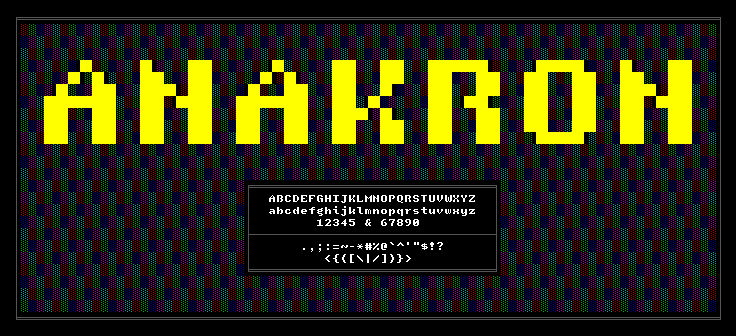

## Table of Contents

- [Overview](#overview)
- [Gallery](#gallery)
- [Installation](#installation)
- [Contributing](#contributing)
- [Licensing](#licensing)

## Overview

**ANAKRON** is an 8x12 bold monospace bitmap font suitable for programming.
Blending the thick strokes of the (C/E/V)GA era fonts with the thin strokes of
more modern pixel fonts, ANAKRON is designed to feel compact like an old-school
8x8 font without compromising on Unicode support.

## Gallery

<strong>Glyphs</strong>

<strong>Glyphs Map</strong>

<strong>Samples</strong>

## Installation

Download from [Releases](https://github.com/molarmanful/ANAKRON/releases).
Included are bitmap formats - BDF, OTB, PCF, DFONT (for Mac users) - as well as
TTF and WOFF. 2x/3x versions are available for HiDPI screens. Note that PCF
doesn't contain glyphs past U+FFFF.

For the crispiest viewing experience, try to use the bitmap formats when
possible. If bitmap fonts are not supported on your platform (e.g. Windows,
VSCode), then use the TTF at font sizes that are multiples of 12px.

> **Quick Tip**: If you need font size in pt, use the following conversion:
>
> `pt = px * 72 / dpi`
>
> e.g. 12px on a 96dpi screen is `12px * 72 / 96dpi = 9pt`.

## Contributing

Issues, feature/glyph requests, and pull requests are all welcome!

## Licensing

Made with ♥ by [the ANAKRON Project Authors](AUTHORS). Released under the
OFL-1.1 License.
